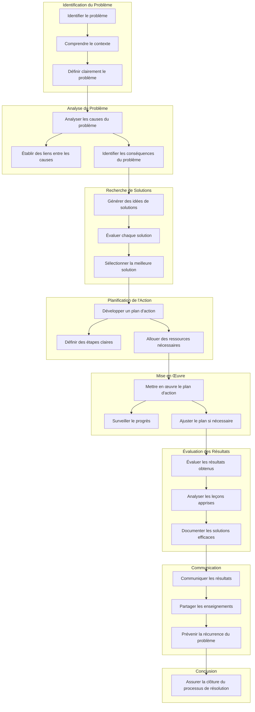

## Test de site d'affiliation automatisé depuis 2021

### |-NOM------------------|-TEMPS----|-RETOUR-----------|-AMELIORATION--|-NOTE---
### |----------------------|----------|------------------|---------------|
### |-Histoire-audio-------|-6-mois---|-0-€---/-0--Mail--|-BUG-AUTO------|-manque-tech
### |-[nobullshitjusttravel](nobullshitjusttravel.com\index.html)-|-6-mois---|-0-€---/-3--Mail--|-RESAUX-------|-manque-tech
### |-[Les-exigeants](les-exigeants\index.html)--------|-3-mois---|-17-€--/-0--Mail--|-RESAUX-+--NL--|-manque-tech
### |-MVG------------------|-1-mois---|-49-€--/-67-Mail--|-mailing-------|-manque-tech-+-biz-pas-aligné
### |-[MICRO-saas](micro-saas\dist\index.html)-----------|-encour---|---€--/---Mail----|---------------|

## bilan à reprendre en fin d'année

